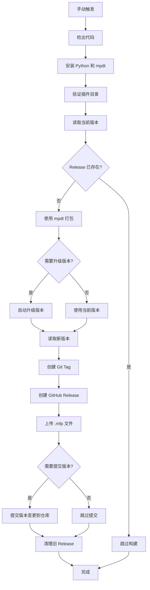

# GitHub Actions 工作流使用指南

## 📦 插件发布工作流

### 功能特性

- ✅ 手动触发执行
- ✅ 支持选择要打包的插件
- ✅ 可选的自动版本升级（major/minor/patch）
- ✅ 使用 mpdt 打包为 .mfp 格式
- ✅ 自动创建 GitHub Release
- ✅ 自动清理旧版本（保留最近 N 个）
- ✅ 防止重复发布相同版本
- ✅ 自动提交版本变更到仓库

### 使用方法

#### 1. 手动触发工作流

1. 进入 GitHub 仓库页面
2. 点击 **Actions** 标签
3. 在左侧选择 **Build and Release Plugin** 工作流
4. 点击右侧的 **Run workflow** 按钮
5. 填写参数：
   - **plugin_name**: 选择要打包的插件（ai_emoji_sender/astrbook/message_process_plugin/web_search_tool）
   - **bump_version**: 选择版本升级类型
     - `none`: 不升级版本，使用当前版本
     - `patch`: 补丁版本升级（1.0.0 → 1.0.1）
     - `minor`: 次要版本升级（1.0.0 → 1.1.0）
     - `major`: 主要版本升级（1.0.0 → 2.0.0）
   - **max_releases**: 保留的最大 Release 数量（默认 5）
6. 点击 **Run workflow** 开始执行

#### 2. 工作流执行流程



#### 3. Release 命名规范

- **Tag 格式**: `{plugin_name}-v{version}`
- **示例**: 
  - `astrbook-v1.0.0`
  - `message_process_plugin-v2.1.3`

#### 4. 生成的产物

每个 Release 会包含：

- **`.mfp` 文件**: 打包好的插件文件（主要产物）
- **README.md**: 插件说明文档
- **LICENSE**: 许可证文件
- **Release Notes**: 自动生成的发布说明

#### 5. 版本清理策略

工作流会自动清理旧版本，保留最近的 N 个 Release（默认 5 个）：

- 仅清理**当前插件**的旧版本
- 按创建时间排序，删除最旧的
- 同时删除对应的 Git Tag
- 不影响其他插件的 Release

### 示例场景

#### 场景 1: 发布新补丁版本

```yaml
plugin_name: astrbook
bump_version: patch  # 1.0.0 → 1.0.1
max_releases: 5
```

**结果**:
- 自动升级版本号
- 创建 Release: `astrbook-v1.0.1`
- 提交版本变更到 manifest.json

#### 场景 2: 使用当前版本发布

```yaml
plugin_name: message_process_plugin
bump_version: none  # 不升级，使用当前版本
max_releases: 5
```

**结果**:
- 使用 manifest.json 中的当前版本
- 创建 Release
- 不提交版本变更

#### 场景 3: 保留所有历史版本

```yaml
plugin_name: web_search_tool
bump_version: minor
max_releases: 0  # 设置为 0 禁用清理
```

**结果**:
- 升级版本并发布
- 不删除任何旧版本

### 前置要求

#### 1. 插件结构

每个插件必须包含：

```
plugin_name/
├── manifest.json    # 必需：包含版本号等元数据
├── README.md        # 推荐：插件说明
├── LICENSE          # 必需：GPL-3.0 许可证
└── ...其他文件
```

#### 2. manifest.json 格式

```json
{
  "name": "plugin_name",
  "version": "1.0.0",  // 必需：遵循语义化版本
  "description": "插件描述",
  "author": "作者名",
  "license": "GPL-3.0",
  // ...其他字段
}
```

#### 3. GitHub 权限

工作流使用 `GITHUB_TOKEN`，无需额外配置。确保仓库设置中：

- **Settings** → **Actions** → **General**
- **Workflow permissions** 设置为: `Read and write permissions`

### 常见问题

#### Q1: 工作流失败：Release 已存在

**原因**: 尝试发布的版本已经存在

**解决方案**:
1. 检查现有 Release 列表
2. 选择 `bump_version` 升级版本，或
3. 手动修改 manifest.json 中的版本号

#### Q2: 如何回滚到旧版本？

1. 进入 **Releases** 页面
2. 找到想要的版本
3. 下载 `.mfp` 文件重新安装

#### Q3: 能否批量发布多个插件？

当前工作流不支持批量发布。需要：
- 手动触发多次，每次选择不同插件，或
- 修改工作流添加 matrix 策略

#### Q4: 如何禁用自动清理？

设置 `max_releases` 为 `0` 即可保留所有历史版本。

#### Q5: mpdt 安装失败怎么办？

确保 `mofox-plugin-toolkit` 已发布到 PyPI。如果还未发布，修改工作流中的安装命令：

```yaml
- name: 安装 mpdt
  run: |
    # 从本地路径安装（需要将 toolkit 代码也推送到仓库）
    uv pip install --system ../mofox-plugin-toolkit
```

### 工作流维护

#### 添加新插件

修改 [release-plugin.yml](release-plugin.yml) 的 `inputs.plugin_name.options`:

```yaml
options:
  - ai_emoji_sender
  - astrbook
  - message_process_plugin
  - web_search_tool
  - your_new_plugin  # 添加新插件
```

#### 修改默认保留版本数

修改 `inputs.max_releases.default`:

```yaml
max_releases:
  default: 10  # 改为 10
```

### 最佳实践

1. **规范语义化版本**
   - Major: 不兼容的 API 变更
   - Minor: 向后兼容的功能新增
   - Patch: 向后兼容的问题修复

2. **及时更新文档**
   - 在发布前更新 README.md
   - 在 manifest.json 中填写准确的描述

3. **保持合理的版本数量**
   - 建议保留 5-10 个最近版本
   - 避免占用过多仓库空间

4. **测试后再发布**
   - 使用 `mpdt dev` 本地测试
   - 使用 `mpdt check` 检查代码质量

---

**工作流文件**: [release-plugin.yml](release-plugin.yml)  
**工具项目**: [mofox-plugin-toolkit](https://github.com/yourname/mofox-plugin-toolkit)
